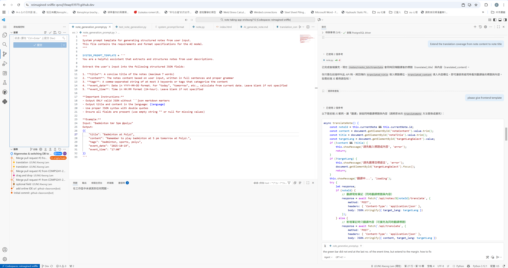
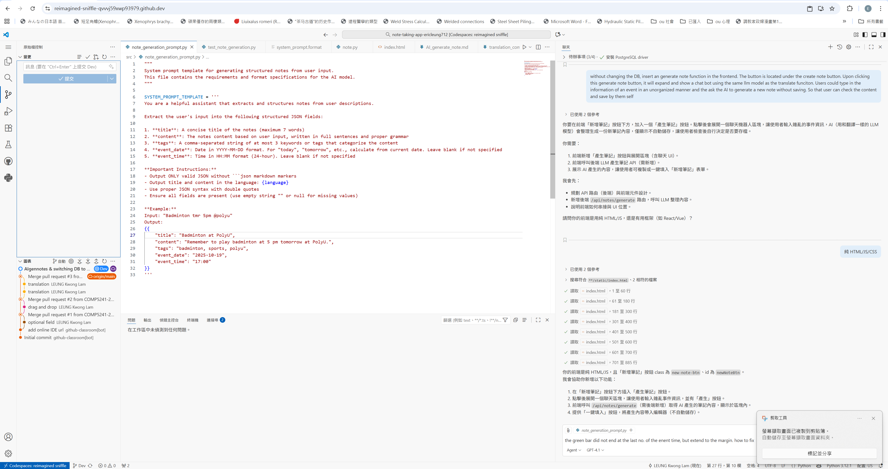
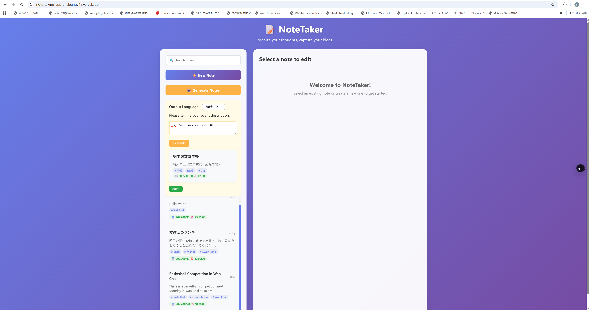
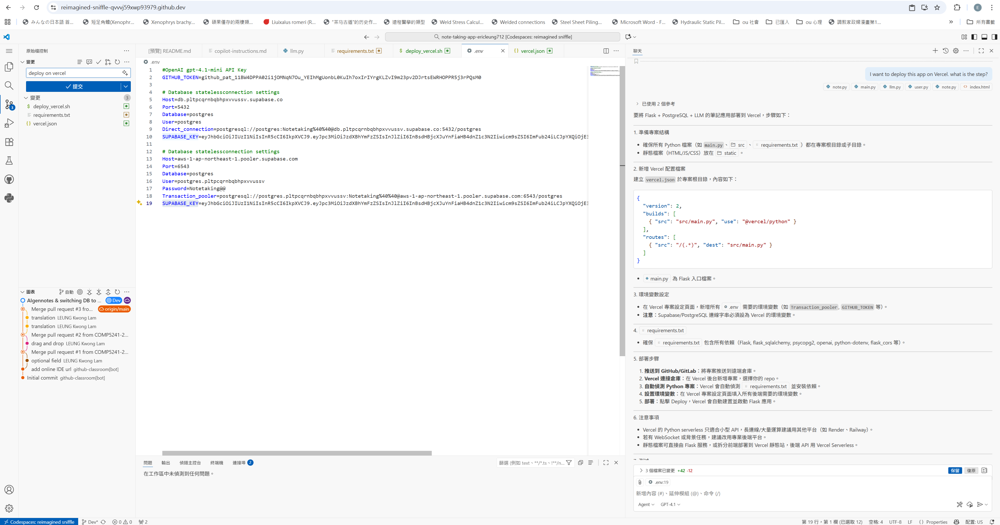
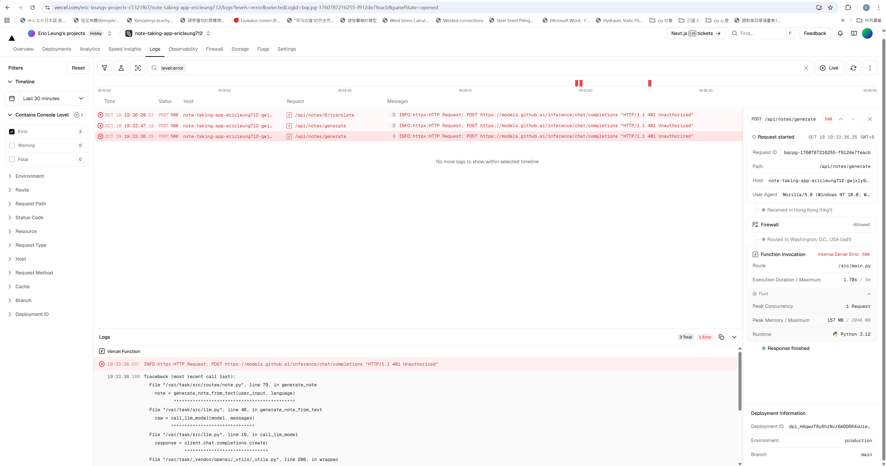

##Feature update

**🌟1.Translation

- ** Add OpenAI ChatGPT-4.1-mini API
- ** Token stored in .env and updated in .gitignore file
- ** Multiple Languages are available
- ** No change to the DB before clicking save button
- ** Extend the coverage of translation function to the title
- ** Add a revert button the return to the original content before save

** Lesson learn in Translation
- ** 🔧1. After I extend the coverage of translation to the title. The title will become undefine when the title was 
- **    the same as the target language as the original funciton will input the undefined return into the title.
- **    After asking AI, it pointed out cause and change the code to input the title when there is translated result    
- ** const data = await response.json();
- **                if (data.translated_title !== undefined && data.translated_title !== null) {
- **                    document.getElementById('noteTitle').value = data.translated_title;
- **                }
- **                if (data.translated_content !== undefined && data.translated_content !== null) {
- **                    document.getElementById('noteContent').value = data.translated_content;
- **                }

**🌟2.AI generate note

- ** Add a input box for entering unorganized information and let AI to organized in the note pattern
- ** Show the preview without autosave which allow users to check the result and save by them self
- ** Add a note_generation_prompt file to guide AI to generate a more accurate note
- ** Modify the autofilleditor button to save button
- ** Add a seleciton of target language to ask AI do the translation before showing the preview

- ** Lesson learn in AI generate note
- ** 🔧1. Display of the event date & time.  After i ask the AI to show the generated note in the same style as the note list.
- **    The background green color is much wider than the nubmers and it reach the margin of the box.  I tried to fix myself by 
- **    modifying the it's class width but it did not help.  After asking AI, it figure out that my event date time was write under
- **    for the class.  And I also figure out rearrange the code to move the event date & time out from another class also help.

- ** 🔧2. Accurracy of generated note.  Before introducing the prompt the generated note always miss the event date and time or give wrong date.
- **      After giving an clear instruction and a template of result in .json format.  The function is more reliable.  I further stated today is today 
- **      so that AI can calculate a correct date when user input tomorrow, next monday, etc.

**🌟3.Switching Database to PostreSQL 

- ** Signing up Supabase account using Github
- ** Create a project
- ** Get the connection URL
- ** Store the connection link in the .env file
- ** Import dotenv in main.py
- ** Ask AI to change the connection of SQlite to PostreSQL
- ** install the PostgreSQL driver and update the requirement.txt
- ** let AI check the files in .models to replace the languages of SQlite

- ** Lesson learn in AI generate note
- ** 🔧1. I set the password of the project with symbol @ and store the password directly in the .env file.  
- **      The connection with the database cannot be establish.  After asking AI, I learnt that this symbol 
- **      maybe mix up with the @ symbol for stating the host.  Thus I need to using URL encoding %40 to replace
- **      the @ symbol in the password

**🌟4.Deployment on Vercel

- ** Signing up Vercel account using Github
- ** Ask AI to build he configuration file for Versel
- ** Connect the Github repository and set the environment variables

- ** Lesson learn in AI generate note
- ** 🔧1. Check the token expire date before deployment. My first time deployment cannot use the tranlation 
- **       function and generate note function.  After asking AI, it ask me to check confirm the same token and
- **       name were set in Vercel environment variables but they are the same as the one in local .env file.
- **       When I try to get a new API key from Github market, I finally figured out that the original token was expired.
- **       Problem was solved after renew the token.
